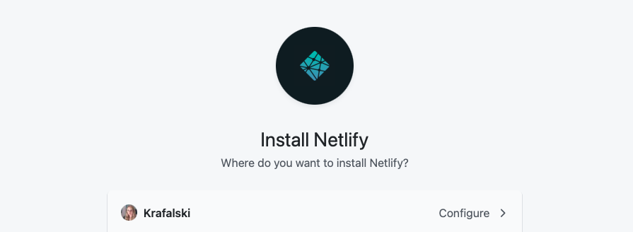
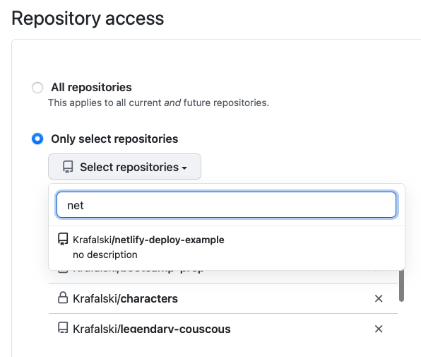
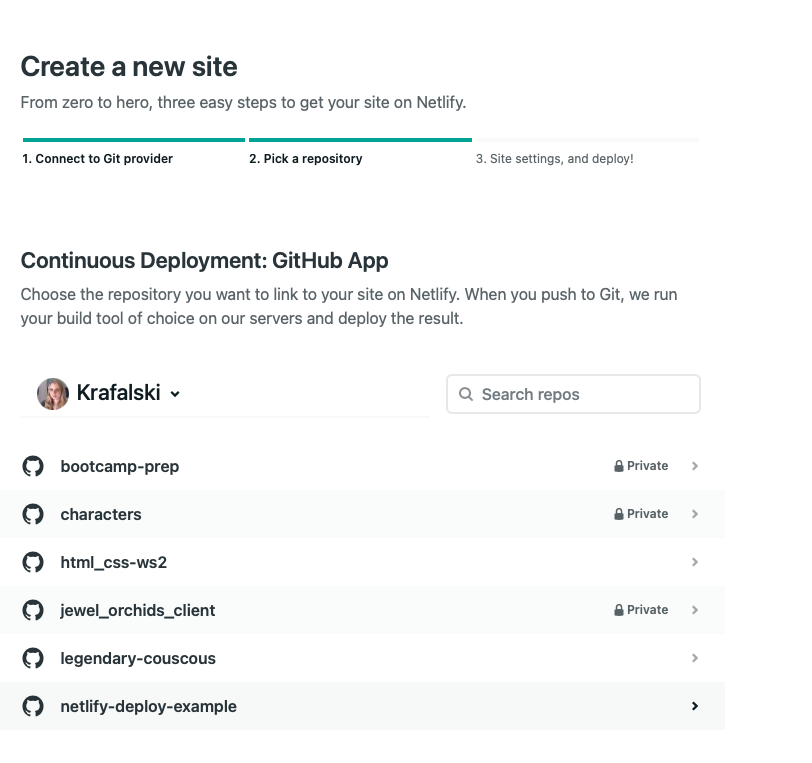
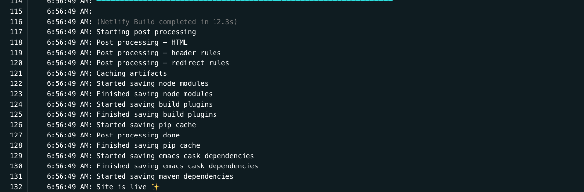
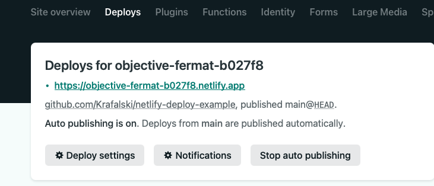

# Set Up Continuous Deployment For create-react-app & netlify

Netlify has a feature where you can configure every push to the `main` branch on GitHub to trigger a new build/update on Netlify.

## Getting Started

- Go to GitHub and create a new repository (use public so instructors can check your work)
- In your `create-react-app` add the new GitHub remote link
- Confirm your `create-react-app` is now on GitHub

**IMPORTANT:** Make sure your app runs locally. If it does not run locally, there is no hope of it working on deployment.

**IMPORTANT:** With continuous deployment, you only want working code to be on `main`, use branches like `dev` to build and confirm a working app before merging into `main`.

## Netlify Settings

Log onto Netlify and go to `Team Overview`, select `New site from Git`

 

 

Choose the `GitHub` button - this will take you to a GithHub authentication view

 

 

Scroll down and select `Configre the Netlify app on GitHub`

 

 

Choose configure to install Netfliy on your GitHub account

 

 

Be sure to remember your GitHub password in order to move forward

 

 

Choose which repo. Use the search bar feature, if needed.

 

 

Once, selected, your view should return to the Netlify dashboard.

 

 

Keep default settings provided, and choose `Deploy site` button

 

 

See status of your deployment. Click on it to see more details

 

 

Check the logs, it is good to get familiar with what is there. When errors occur with the build, this is where you would go to debug.

 

 

Check for `Site is live ✨` - to confirm your site is live

 

 

Go to the `Deploys` tab and you can then click on the link to see your site life. You can also share this link with your friends and family!

 

 
